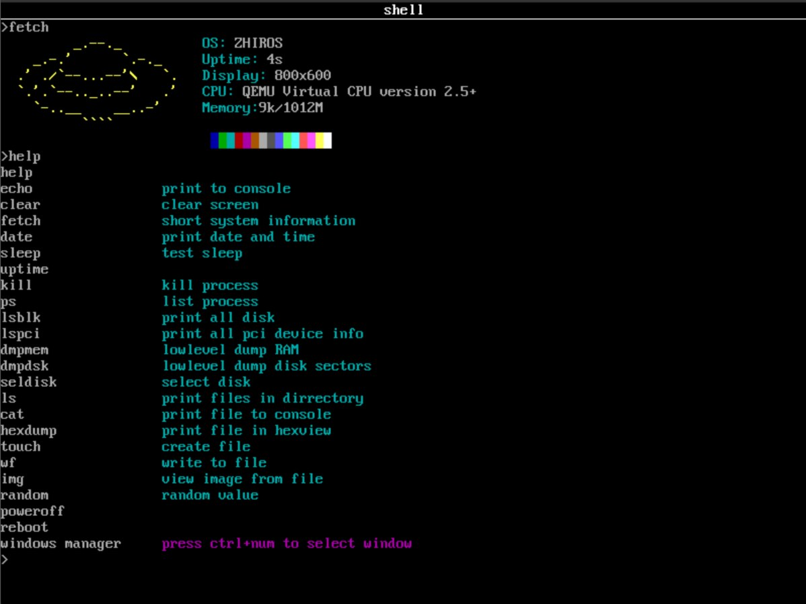
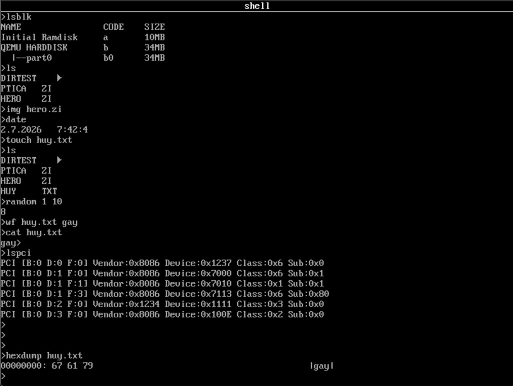

# ZhirOS system

---

## 🚀 Quick Start

Here's a simple guide  to do ZhirOS in few minues:

### 1. Environment preparing
Once you do something,create an rd(ramdisk):
`make create_rd`

### 2. Compilation  and launching(The main way)
If you want GRUB and framebuffer inside the QEMU,do this:
`make run_all`

---

## ⚠️ Problems and solvings
If you get a trouble with the main way,you would do this:
`make clean build run_qemu`

> **IMPORTANT:**  While that method is used **the framebuffer won't  work anyway**. It's very good to attempt to solve the problems with GRUB to enjoy ZhirOS completely.
---

## 📸 Screenshots of system

  
  
  

