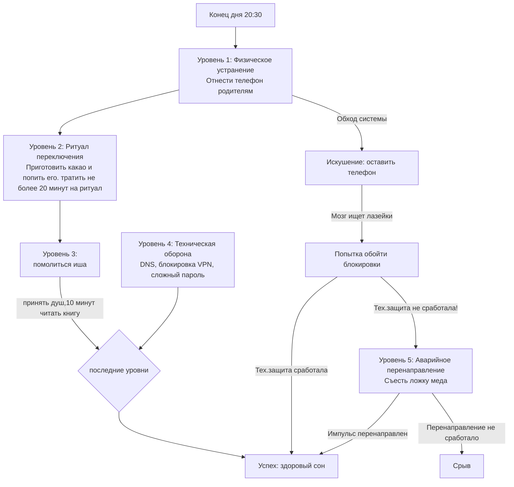

```mermaid

graph TD
A[Конец дня 20:30] --> B[Уровень 1: Физическое устранение<br>Отнести телефон родителям]
B --> C[Уровень 2: Ритуал переключения<br>Приготовить какао и попить его. тратить не более 20 минут на ритуал]
C --> D[Уровень 3: <br>помолиться иша]
D -- принять душ,10 минут читать книгу --> L{последние уровни}

E[Уровень 4: Техническая оборона<br>DNS, блокировка VPN, сложный пароль] -->  L
L --> F[Успех: здоровый сон]
    
B -- Обход системы --> H[Искушение: оставить телефон]
H -- Мозг ищет лазейки --> I[Попытка обойти блокировки]
I -- Тех.защита сработала --> F

I -- Тех.защита не сработала! --> J[Уровень 5: Аварийное перенаправление<br>Съесть ложку меда]
J -- Импульс перенаправлен --> F
J -- Перенаправление не сработало --> K[Срыв]
```
