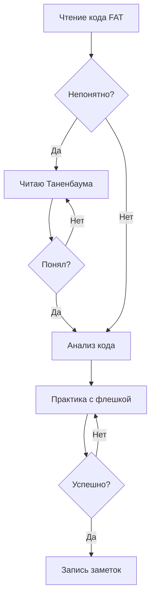

# пункты о заметках
- перестать  писать ежедневные заметки для задач через плагин kanban. он приносит неудобства, например не получится писать адекватно код, или большие тексты. что в обычных заметках это более удобно писать.
- нужно разрешить себе выполнять любую задачу , хоть нежелательную. главное чтобы в течение дня были выполнены обязательные задачи(все)
- можно изменять приоритет задач, на ранг выше или ранг ниже.  например задача "помыть посуду" была обязательной, но родители сказали ехать на речку, я могу сделать задачу "помыть посуду" желательной

# пункты о работе
- вернуть режим поммодоро. 25 минут работать на полной концентрации, а 5 минут полностью отдыхать, прям только лежать и ничего не делать
- вернуть больше практики в обучение. например я изучил функцию в FAT, теперь я создаю FAT на флешке и смотрю как ведет себя эта функция при  определенных условиях. в целом обучение теперь проходит так:

# пункты о сне
- надо полностью убрать мысли о прогграмировании после 9 вечера. Прям совсем. лучше почитай книгу "ужасы фазбера", конечно это бредовая книга(чего стоит только 1 история где девочка превратилась в груду мусора(что за бред?)) но эта книга легко читается, и отводит мозг от мыслей

# пункты о еде
- вернуть зеленый чай в рацион. конечно я не пью чай с сахаром, просто предупреждаю что надо пить зеленый чай с медом. зеленый чай улучшает концентрацию и успокаивает
- нужно вернуть сбалансированое питание. не надо есть кашу утром и сразу чай, не надо есть борщ и сразу есть мороженое. так микроэлементы не усваиваются.

# пункты о Танебауме
- не читать Танебаума утром!я сереьзно, даже не думай открывать "Совеременные операционые системы" или "компьютерные сети". Это материал для подготовленного мозга. лучше утром попиши на holy c или поройся в temple os, ты хотя бы посмеешься с одновременно гениальности, и одновременно безумия Терри Девиса
- не использовать Танебаума как материал для повторения. Танебаум - абсолютно точно самый авторитетный источник для получения нового материала, но Танебаум если не худший то точно в топ-5 худших источников для повторения материала. его стиль - очень хорош для получения знаний, но худший для повторения знаний.  Лучше пиши заметки, и повторяй через них. Относись к Танебауму и заметкам как к  инструментам - это не Панацеи, но у них противоположные плюсы и минусы поэтому они друг друга дополняют, а не заменяют